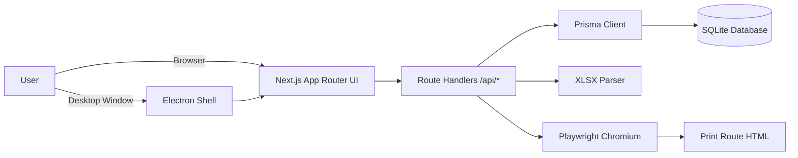
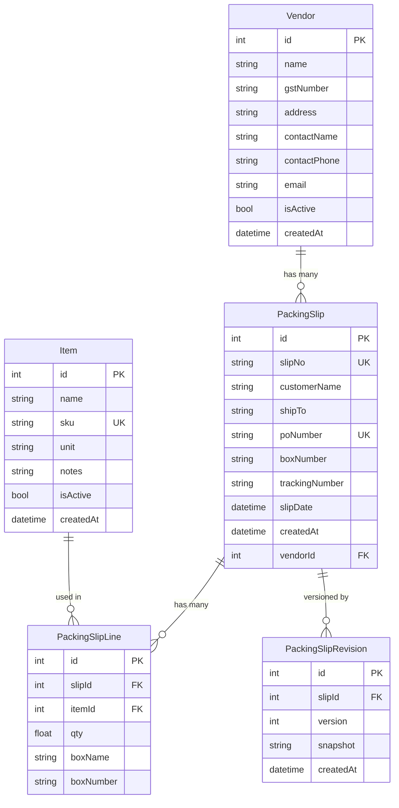
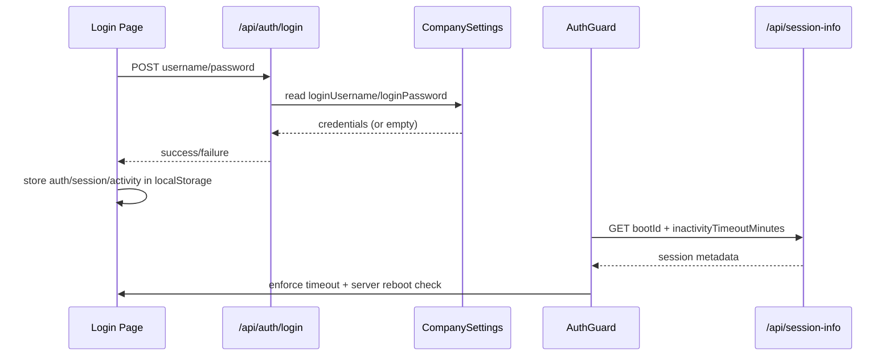
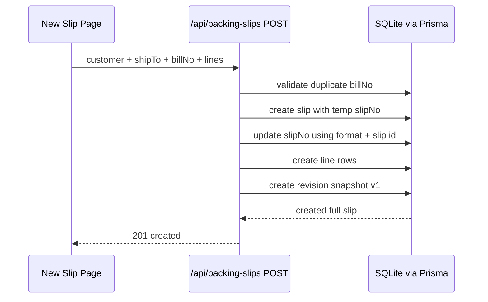
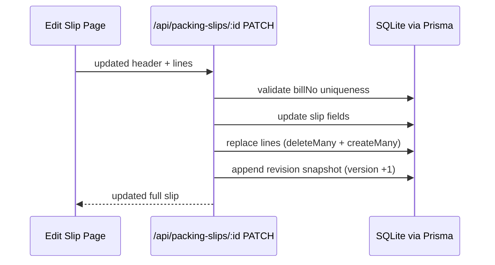
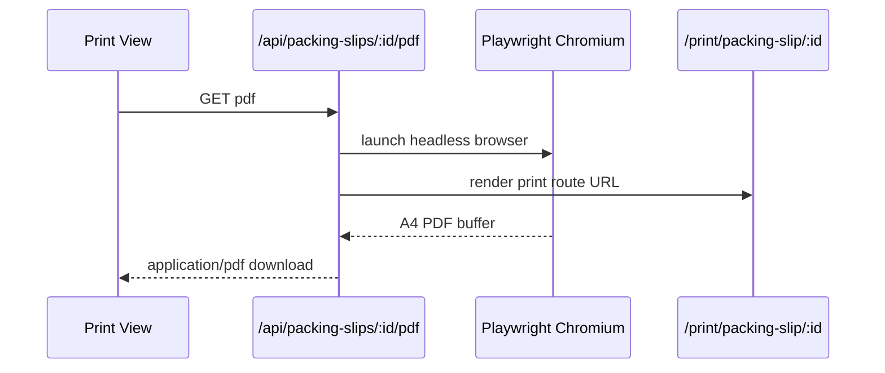
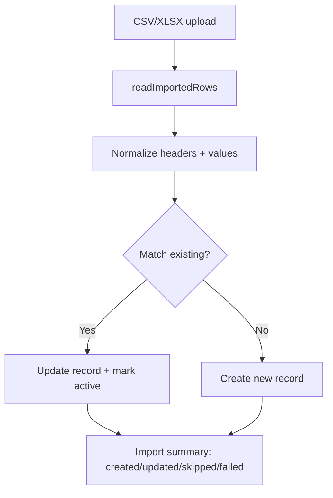

# PackPro Slip

PackPro Slip is a Next.js + Prisma application for creating packing slips, generating printable documents/PDFs, and managing item/customer masters.  
It can run as:

- Web app (browser + local/hosted Next server)
- Desktop app (Electron wrapper with offline SQLite in user data)

## Contents

- Overview
- Tech Stack
- Architecture
- Data Model
- Data Flow Diagrams
- API Surface
- Project Structure
- Setup and Run
- Desktop Packaging
- Configuration
- Troubleshooting

## Overview

Core capabilities:

- Customer master management (active/inactive + import from CSV/XLSX)
- Item master management (active/inactive + import from CSV/XLSX)
- Packing slip create/edit/search with line items and box numbers
- Revision history snapshots per slip version
- Printable packing slips and shipping labels
- PDF export for packing slips using Playwright
- Admin settings for branding, login credentials, theme, timeout, numbering format
- Cleanup actions for slips/items/customers (with safety checks)

## Tech Stack

- Frontend/UI: Next.js 13 (App Router), React 18
- API: Next.js Route Handlers (`src/app/api/**`)
- ORM: Prisma 5
- Database: SQLite
- PDF rendering: Playwright (Chromium)
- Desktop runtime: Electron + electron-builder

## Architecture



Runtime notes:

- Web mode uses `.env` `DATABASE_URL` (default `file:./prisma/dev.db`).
- Desktop packaged mode starts an internal Next server and points Prisma to a per-user DB under Electron `userData`.
- Desktop preload exposes `window.packpro` bridge for `quit` and native print.

## Data Model

Prisma schema: `prisma/schema.prisma`



## Data Flow Diagrams

### 1) Login + Session Guard



### 2) Create Packing Slip



### 3) Edit Packing Slip + Versioning



### 4) PDF Generation



### 5) Master Import (Items/Customers)



## API Surface

### Auth and session

- `POST /api/auth/login` - validate credentials from settings (fallback `admin/admin` if unset)
- `GET /api/session-info` - server boot ID + inactivity timeout

### Settings and admin

- `GET /api/settings` - fetch company/app settings
- `POST /api/settings` - save settings (theme, branding, login, timeout, numbering format)
- `POST /api/admin/cleanup` - cleanup slips/items/customers/labels (labels are non-persistent)

### Customers (vendors in schema)

- `GET /api/vendors`
- `POST /api/vendors`
- `PATCH /api/vendors/:id` (active flag)
- `DELETE /api/vendors/:id`
- `POST /api/vendors/import` (CSV/XLSX import)

### Items

- `GET /api/items`
- `POST /api/items`
- `PATCH /api/items/:id`
- `DELETE /api/items/:id`
- `POST /api/items/import` (CSV/XLSX import)

### Packing slips and documents

- `GET /api/packing-slips`
- `POST /api/packing-slips`
- `GET /api/packing-slips/:id`
- `PATCH /api/packing-slips/:id`
- `GET /api/packing-slips/next-number`
- `GET /api/packing-slips/revisions`
- `GET /api/packing-slips/:id/pdf`

## Project Structure

```text
src/
  app/
    api/                      # Route handlers (server APIs)
    packing-slip/             # Create/edit flows
    print/                    # Print-optimized slip page
    shipping-labels/          # Label generator pages
    vendors/                  # Customer master UI
    items/                    # Item master UI
    admin/                    # Settings and cleanup UI
    history/                  # Recent slips, versions, reports
  components/                 # Auth guard, nav, print controls, desktop controls
  lib/
    prisma.ts                 # Prisma bootstrap + DATABASE_URL normalization
    import-sheet.ts           # CSV/XLSX parser helpers
    validators.ts             # Email/phone/GST normalization + validation
desktop/
  main.js                     # Electron main process + embedded Next server
  preload.js                  # Safe window bridge
  scripts/prepare-desktop.js  # Build prep (template DB + prisma runtime copy)
prisma/
  schema.prisma               # Data model
```

## Setup and Run

### Prerequisites

- Node.js 18+
- npm
- `sqlite3` CLI (required for `npm run desktop:prepare`)
- Playwright Chromium (required for PDF endpoint)

### Install

```bash
npm install
```

### Environment

`.env` default:

```bash
DATABASE_URL="file:./prisma/dev.db"
```

If you are setting up from scratch and DB/tables do not exist:

```bash
npx prisma generate
npx prisma db push
```

### Run web app

```bash
npm run dev
```

Open `http://localhost:3000`.

### Enable PDF generation

```bash
npx playwright install chromium
```

## Desktop Packaging

### Run desktop in development

```bash
npm run desktop:dev
```

### Build installers

```bash
npm run desktop:dist
```

Platform-specific:

```bash
npm run desktop:mac
npm run desktop:win
npm run desktop:win:portable
```

Important:

- `desktop:prepare` expects `prisma/dev.db` to exist.
- Packaged app creates/uses DB at:
  `~/Library/Application Support/<App>/db/packpro-slip.db` (macOS style path under Electron `userData`)
- Logs are written to `<userData>/logs/main.log`.

## Configuration

Admin page (`/admin`) controls:

- Company identity: name, address, GST, phone, email, logo
- Slip numbering format:
  - Supports `{SEQ}` token, example `PS-{SEQ}`
  - If token missing, trailing numeric part is replaced, or sequence is appended
- Theme: `sunset`, `ocean`, `forest`, `midnight`
- Session inactivity timeout (minutes)
- Login username/password used by `/api/auth/login`

## Troubleshooting

- PDF download fails with Chromium error:
  - Run `npx playwright install chromium`
- Desktop build fails on missing DB template:
  - Create schema first via app run or `npx prisma db push`
  - Then run `npm run desktop:prepare`
- Login fails after server restart:
  - `AuthGuard` compares boot IDs and forces re-login by design
- Cannot delete customer/item:
  - Records used in packing slips are protected by FK constraints; set inactive instead

## Scripts

- `npm run dev` - Next development server
- `npm run build` - Next production build
- `npm run start` - Next production server
- `npm run prisma` - Prisma CLI passthrough
- `npm run desktop:dev` - Next dev + Electron
- `npm run desktop:prepare` - Prepare desktop assets/template DB
- `npm run desktop:dist` - Build macOS + Windows installers
